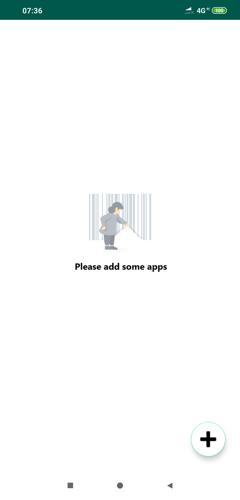
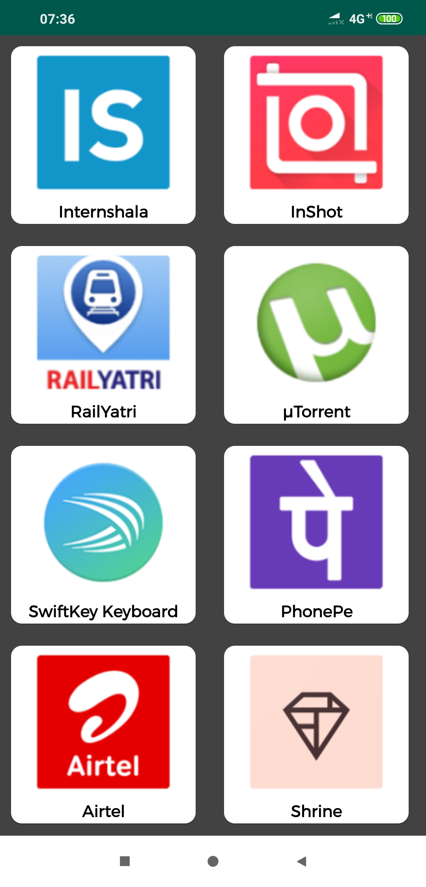
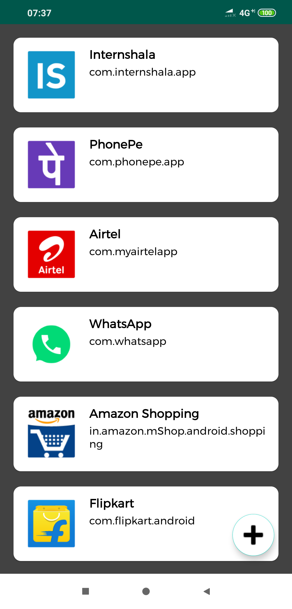
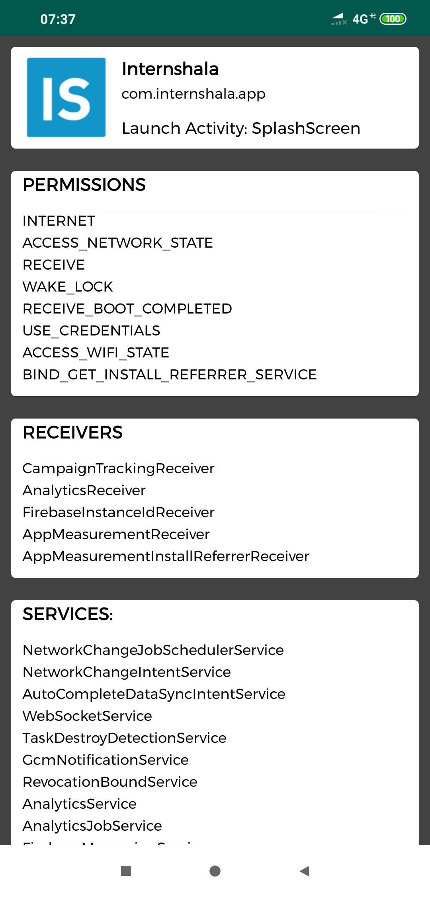

# Installed_Apps_Information
This app lists all apps installed in your phone and shows info like permissions, launch activity, package name, recievers and services relating to the corresponding app.

Below are the screenshots:

  <h4>Empty view when no app is selected:</h4>
  

  <h4>Clicking on FAB shows you list of installed applications:</h4>
  

  <h4>Select any app to show them on your main screen:</h4>
  

  <h4>Clicking on any app shows you its corresponding information like - Package Name, Launch Activity, Permissions, Receivers and          Services:</h4>
  

